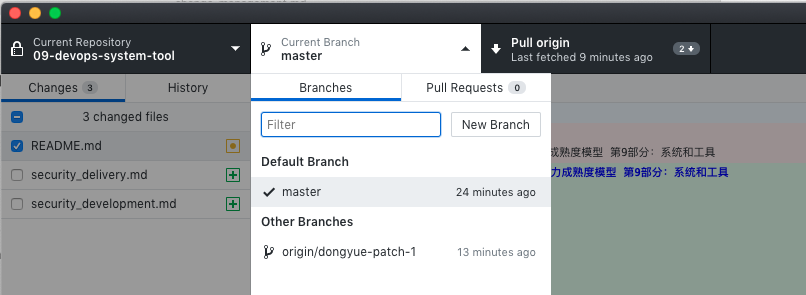

# 研发运营一体化（DevOps）能力成熟度模型 第9部分：系统和工具

研发运营一体化（DevOps）能力成熟度模型 第9部分：系统和工具（DevOps 产品标准）属于研发运营一体化（DevOps）能力成熟度模型系列标准的一部分，旨在通过行业的力量，规范化DevOps产品的功能特性，帮助企业建设、选型和购买DevOps产品工具。

本标准由DevOps标准工作组下DevOps产品工作小组负责编写和维护。

### 目录

#### 1. [项目与开发管理](project_and_development_management.md)

#### 2. [应用设计与开发](application_design_and_development.md)

#### 3. [持续交付](continuous_delivery.md)

#### 4. [测试管理](test_management.md)

#### 5. [自动化测试](test_automation.md)

#### 6. 技术运营（待定）

#### 7. [安全开发](security_development.md) \ [安全交付](security_delivery.md) \ 安全运营

### 协作模式

该标准基于Markdown（纯文本）的方式编写，采用Github进行统一的版本管理和变更管理。

#### 1. 协作流程

1. 如何下载标准内容：`git cloe git@github.com:docmm/09-devops-system-tool.git`

2. 如何修改并提交标准内容：

   1. Fork仓库或在本地创建分支

      

      在Github Desktop 中点击创建分支，输入分支名称即可

   2. 参考Markdown[格式说明](http://www.markdown.cn/)，在本地采用Markdown编辑器进行内容修改即可

   3. 提交到Github（git add->git commit->git push origin 分支名称）

   4. 发起Pull Request，申请合并修改内容，请详细描述Pull Request理由

   5. 各能力项组长Review提交内容后确认是否接受Pull Request

3. 如何管理长期的待办事项

   1. 创建Issue，填写待办事项

#### 2. 推荐工具

1. Markdown 编辑器
   1. Typora：https://typora.io（Window/Mac/Linux）
2. Github 管理
   1. GitHub Desktop：https://desktop.github.com
   2. 其他工具：Git/TortoiseGit等
 #### 注意事项

1. 注意修改前请获取最新的提交

### 分工表

#### 1. [项目与开发管理](project_and_development_management.md)

| 能力项 | 项目管理 | 需求管理               | 计划与任务管理                  | 文档与知识管理         | 团队协同                    | 统计度量               | 项目集管理             |
| ------ | -------- | ---------------------- | ------------------------------- | ---------------------- | --------------------------- | ---------------------- | ---------------------- |
| 组长   | 空缺     | 空缺                   | 亚信科技                        | 华为云                 | 华为云                      | 阿里云                 | 阿里云                 |
| 成员   | 空缺     | 腾讯云/华为云/浙江移动 | 腾讯云/华为云/亚信科技/浙江移动 | 腾讯云/华为云/浙江移动 | 腾讯云/华为云/泰岳/浙江移动 | 华为云/阿里云/浙江移动 | 腾讯云/华为云/浙江移动 |

#### 2. [应用设计与开发](application_design_and_development.md)

| 能力项 | 应用框架                | 云IDE         |
| ------ | ----------------------- | ------------- |
| 组长   | 腾讯              | 华为云        |
| 成员   | 华为云/阿里云/腾讯/谐云 | 华为云/阿里云 |

#### 3. [持续交付](continuous_delivery.md)

| 能力项 | 源代码管理                                                   | 构建管理                                                     | 持续集成                                                     | 流水线                                                       | 制品管理                                                     | 发布管理                                                     | 环境管理                                                     | 数据管理                                                     |                         应用配置管理                         |
| ------ | ------------------------------------------------------------ | ------------------------------------------------------------ | ------------------------------------------------------------ | ------------------------------------------------------------ | ------------------------------------------------------------ | ------------------------------------------------------------ | ------------------------------------------------------------ | ------------------------------------------------------------ | :----------------------------------------------------------: |
| 组长   | 腾讯云                                                       | 腾讯云                                                       | 灵雀云                                                       | 华为云                                                       | 阿里云                                                       | 腾讯云                                                       | 优维科技                                                     | 待定                                                         |                            阿里云                            |
| 成员   | 阿里云/腾讯云/华为云/京东云/灵雀云/电信研究院/谐云/中兴/浙江移动 | 阿里云/腾讯云/华为云/京东云/灵雀云/电信研究院/谐云/中兴/浙江移动 | 阿里云/腾讯云/华为云/京东云/灵雀云/电信研究院/谐云/中兴/亚信科技/浙江移动 | 阿里云/腾讯云/华为云/京东云/灵雀云/电信研究院/谐云/中兴/优维科技/亚信科技/浙江移动 | 阿里云/腾讯云/华为云/京东云/灵雀云/电信研究院/谐云/中兴/浙江移动 | 阿里云/腾讯云/华为云/京东云/灵雀云/电信研究院/谐云/中兴/优维科技/浙江移动 | 阿里云/腾讯云/华为云/京东云/灵雀云/电信研究院/谐云/中兴/优维科技/浙江移动 | 阿里云/腾讯云/华为云/京东云/灵雀云/电信研究院/谐云/中兴/浙江移动 | 阿里云/腾讯云/华为云/京东云/灵雀云/电信研究院/谐云/中兴/优维科技/浙江移动 |

#### 4. [测试管理](test_management.md)

| 能力项 | 用例与测试计划管理                                           | 缺陷管理                                             | 测试数据管理                                         |
| ------ | ------------------------------------------------------------ | ---------------------------------------------------- | ---------------------------------------------------- |
| 组长   | 中兴                                                         | 阿里云                                               | 华为云                                               |
| 成员   | 华为云/腾讯云/中兴/阿里云/京东云/电信研究院/亚信科技/浙江移动 | 华为云/腾讯云/中兴/阿里云/京东云/电信研究院/浙江移动 | 华为云/腾讯云/中兴/阿里云/京东云/电信研究院/浙江移动 |

#### 5. [自动化测试](test_automation.md)

| 能力项 | 代码质量管理                                                 | 单元测试                                                     | 接口/服务测试                                                | UI测试                                               | 移动应用测试                                         | 性能测试                                                     |
| ------ | ------------------------------------------------------------ | ------------------------------------------------------------ | ------------------------------------------------------------ | ---------------------------------------------------- | ---------------------------------------------------- | ------------------------------------------------------------ |
| 组长   | 腾讯云                                                       | 亚信科技                                                     | 华为云                                                       | 阿里云                                               | 腾讯云                                               | OneAPM                                                       |
| 成员   | 阿里云/腾讯云/华为云/京东云/灵雀云/电信研究院/谐云/中兴/浙江移动/亚信科技 | 华为云/腾讯云/中兴/阿里云/京东云/电信研究院/亚信科技/浙江移动 | 华为云/腾讯云/中兴/阿里云/京东云/电信研究院/亚信科技/浙江移动 | 华为云/腾讯云/中兴/阿里云/京东云/电信研究院/浙江移动 | 华为云/腾讯云/中兴/阿里云/京东云/电信研究院/浙江移动 | 华为云/腾讯云/中兴/阿里云/京东云/电信研究院/OneAPM/MicroFocus/浙江移动 |

#### 6. 技术运营（待定）

#### 7. [安全开发](security_development.md) \ [安全交付](security_delivery.md) \ 安全运营

| 能力域 | 安全开发                                                | 安全交付                                    | 安全运营 |
| ------ | ------------------------------------------------------- | ------------------------------------------- | -------- |
| 能力项 | 代码安全与合规管理                                      | 安全测试                                    | 暂无     |
| 组织   | 华为云                                                  | 阿里云                                      | 腾讯云   |
| 成员   | 阿里云/腾讯云/华为云/京东云/灵雀云/电信研究院/谐云/中兴 | 华为云/腾讯云/中兴/阿里云/京东云/电信研究院 |          |

